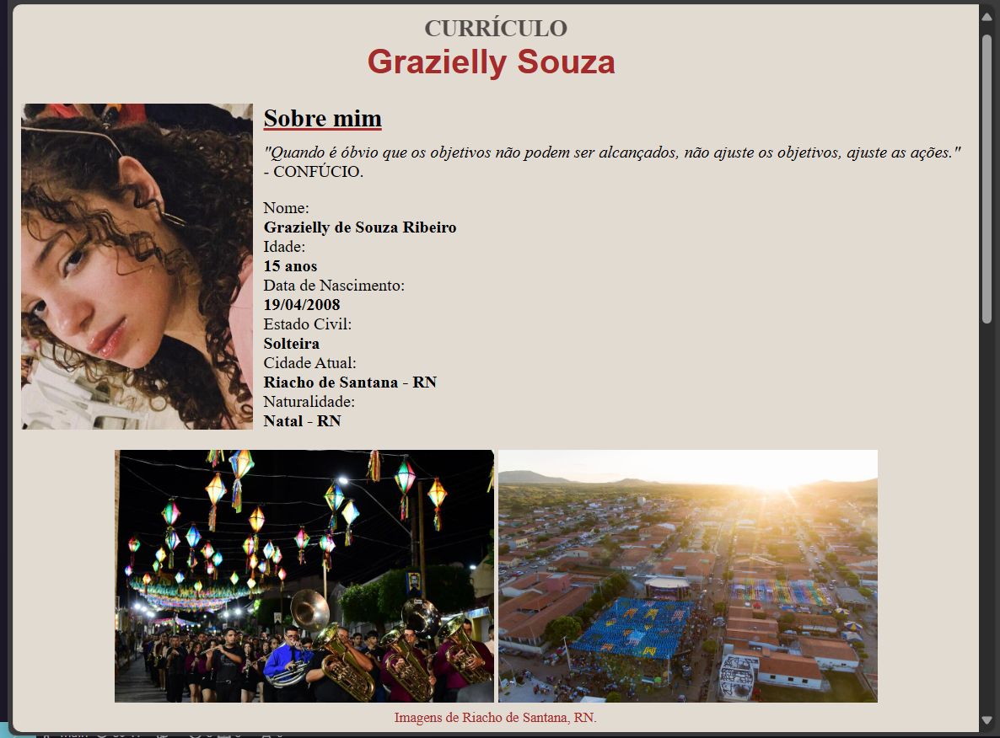

<h1 align="center">Grazielly Souza</h1>

#### 💖 Preview Page
<h2>Page of Contents:</h2>

- [Screenshot](#📸-screenshot)
- [Links](#🔗-links)
- [Built With](#👩🏼‍💻-built-with)
- [Content](#🗃️-content)
- [Author](#📌-author)

# 📸 Screenshot

<small><b>Initial Page of Currículo: ⇧</b></small>

.
# 🔗 Links
- Live URL: [curriculograzys.com](https://grazysss.github.io/curriculo-grazy/)
- Repository URL: [REPO on Github](https://github.com/grazysss/curriculo-grazy/)

.
# 👩🏼‍💻 Built with
 - HTML
 - CSS
 - Flexbox
 - Table
 - List
 - Git
 - Github

.
# 🗃️ Content:

Currículo Base - Atividade Acadêmica do Componente Curricular: Autoria Web Design. 
- Possui dados como:  
  - <b>Origem  
  - Características  
  - Hobbies  
  - Cursos  
  - Formação  
  - Educação  
  - Contato</b>

# 📌 Author
